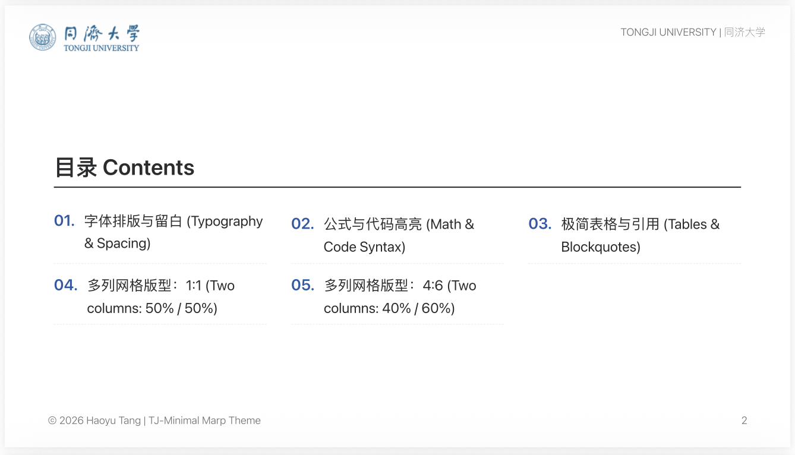
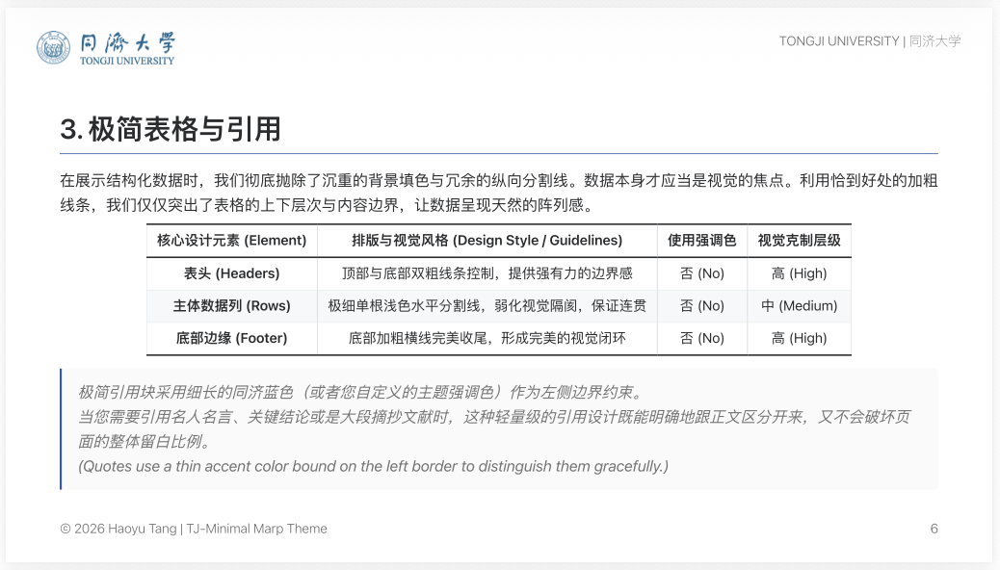
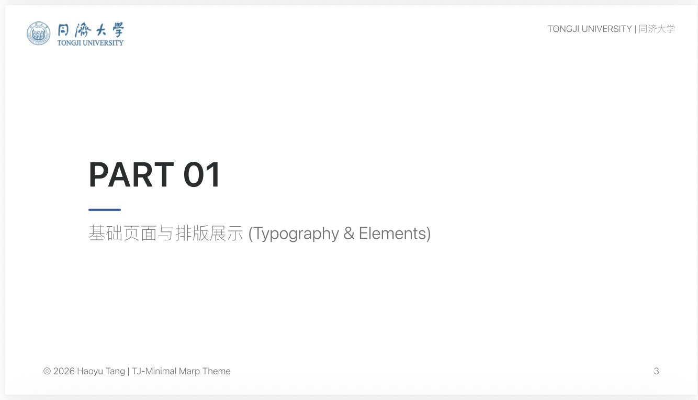
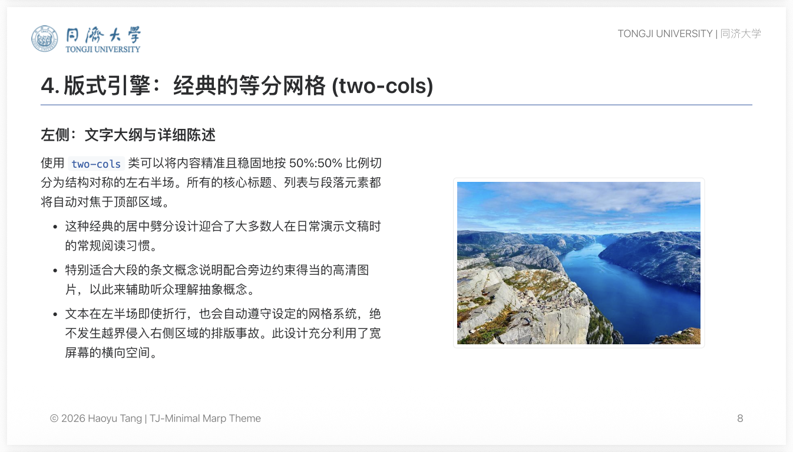
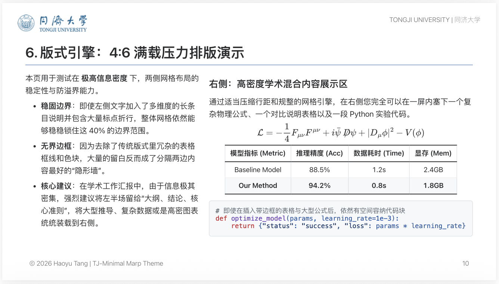

# TJ-Minimal 
**作者:** 汤皓宇
**主题名称:** TJ-Minimal  

TJ-Minimal 是一款专为崇尚极简主义与呼吸感排版的演示文稿设计的 **Marp 主题** 以及 **PPT 模板**。基于 Marp 生态开发，它移除了多余的色彩填充和复杂的背景修饰，将所有注意力聚焦于内容本身、优雅的排版和极致的数理公式渲染。

## 特性
- **极简排版**: 统一化且克制的元素与留白，具有充分的呼吸感。
- **同济蓝强调色**: 吸取极简视觉风格，同时植入学院风格。
- **自定义布局引擎**: 支持等分网格 (`two-cols`) 与 4:6 分区布局 (`two-cols-46`)，提供灵活多变的排版选择。
- **增强组件**: 高亮代码环境与优化的 MathJax 渲染支持。

## 效果预览

### 封面与目录



### 基础排版与过渡



### 多栏网格布局



### 尾页


## 目录结构
- `/theme/TJ-Minimal.css` - 主题的核心 CSS 样式文件。
- `/markdown/template.md` - 演示此主题功能的模板 Markdown 文件。

## 使用方法 (基于 VS Code)
1. 在 VS Code 中安装 **Marp for VS Code** 插件。
2. 打开 VS Code 设置，在 `Workspace Settings` (.vscode/settings.json) 中添加自定义主题路径：
   ```json
   {
       "marp.themes": [
           "./theme/TJ-Minimal.css"
       ]
   }
   ```
3. 在 Markdown 文件的最顶部 Front-matter 区域声明使用主题：
   ```yaml
   ---
   marp: true
   theme: TJ-Minimal
   ---
   ```
4. 点击 VS Code 编辑器右上角的 **Marp** 预览按钮查看幻灯片渲染效果，或将幻灯片导出为 PDF、PPTX。

